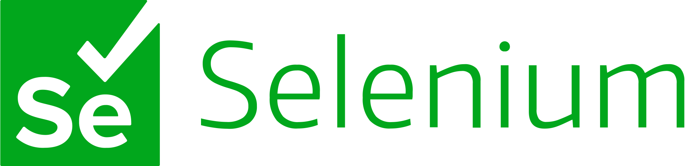
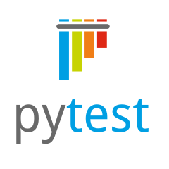
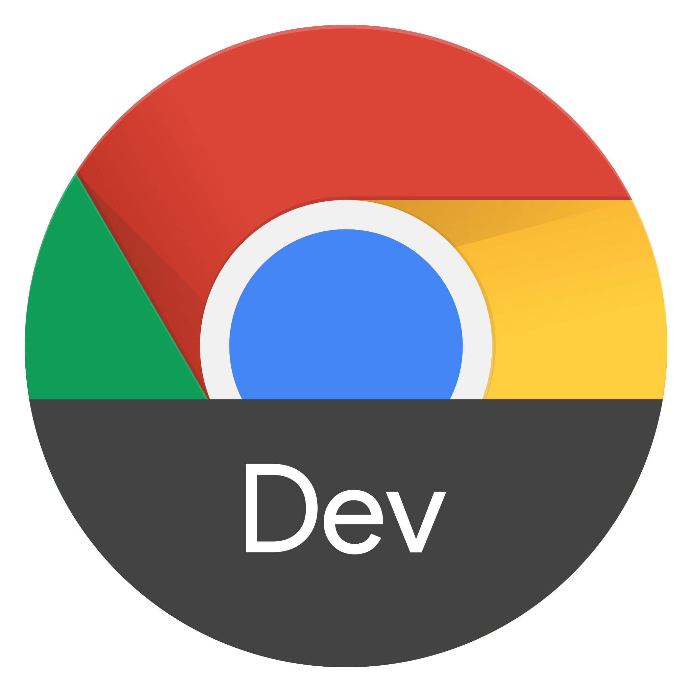
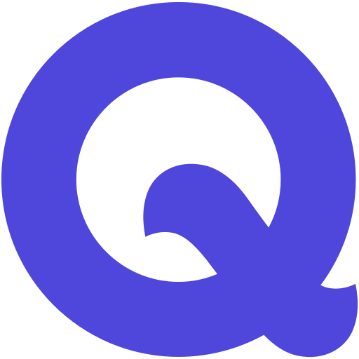

<head><link rel="stylesheet" type="text/css" href="styles.css">
<link rel="stylesheet" type="text/css" href="styles.css">
</head>

# Hi, my name is Siyavush!

- [About Me](#about-me)
- [Professional Skills](#professional-skills)
- [Technical Toolbox](#technical-toolbox)
- [Projects](#projects)
- [Test Case Management](#test-case-management)
- [Certifications](#certifications)
- [Get in Touch](#get-in-touch)

## About Me 👨‍💻
I am an experienced Quality Assurance Engineer with over 2 years of experience in ensuring software quality. My detail-oriented approach and strong analytical skills enable me to troubleshoot issues effectively and maintain high standards of quality.

## Professional Skills
- **Quality Assurance**: Strong knowledge of QA methodologies and tools, with a proven ability to identify and resolve defects early in the development cycle.
- **Analytical Skills**: Detail-oriented with strong analytical and troubleshooting skills, ensuring the delivery of high-quality products.
- **Organizational Skills**: Excellent organizational and time-management skills, capable of managing multiple projects efficiently.
- **Testing Expertise**: Expert in manual testing, as well as bug tracking and reporting.
- **SDLC & Agile**: Experience in Software Development Life Cycles (SDLC) and Agile methodologies, contributing to the successful delivery of projects.

## Technical Toolbox

### Languages + Frameworks + Databases

<a href='https://www.w3.org/Style/CSS/'>

### Tools

### TMS + PMS

## Projects

### PRM (Partner Relationship Management System)

- **Overview**: Spearheaded the QA process for a cutting-edge PRM system designed to streamline partner engagement and collaboration. This platform serves as a central hub for managing partner interactions, tracking sales metrics, and fostering communication.

- **Challenges**: Starting from scratch without a mentor was a formidable challenge. I had to self-educate on best practices and establish a testing framework that could scale with the project. Another significant challenge was ensuring comprehensive test coverage across a diverse set of features and user scenarios.

- **Outcomes**: My initiative in setting up a robust testing ground paid off, resulting in a 40% reduction in post-release defects and a marked improvement in product stability. The thorough testing practices I implemented led to enhanced partner satisfaction and a more reliable system.

- **Tools Used**: Utilized Selenium with Python for automation, PyTest for framework structuring, PostgreSQL for database testing, Postman for API testing, and Swagger for documentation.

### Corporate Banking System

- **Overview**: Led the quality assurance initiative for a comprehensive Corporate Banking System, facilitating complex financial transactions and providing a secure platform for corporate clients. The system integrates various banking services, including loans, asset management, and treasury operations.

- **Challenges**: The complexity of financial regulations and the need for absolute data security were the main hurdles. I had to devise a testing strategy that could accommodate frequent regulatory updates and stringent security requirements.

- **Outcomes**: My strategic approach to testing resulted in a 30% improvement in the system's performance and security posture. The proactive identification and resolution of potential security vulnerabilities contributed to a robust and trustworthy banking platform.

- **Tools Used**: Developed test cases using Qase, performed database testing with DataGrip, executed API testing through Postman, and managed defect tracking with Linear and Qase.

## Test Case Management

My approach to test case design, execution, and maintenance is rooted in a systematic and thorough methodology that ensures the delivery of high-quality software products. Here's an insight into my process:

### Test Case Design
- **Understanding Requirements**: I start by immersing myself in the software requirements, user stories, and acceptance criteria to ensure a solid foundation for test creation.
- **Defining Scope**: I meticulously define the scope of testing for each feature to guarantee comprehensive coverage.
- **Prioritizing Test Cases**: Business impact, criticality, and user behavior guide my prioritization of test cases, ensuring the most important aspects are tested first.
- **Writing Clear Test Cases**: Clarity is key in my test cases, which include detailed test steps, expected results, and test data.
- **Reviewing and Refining**: Collaboration with peers and stakeholders is vital, as it helps refine the test cases to perfection.

### 🏃 Test Execution
- **Preparing Test Environment**: I ensure the test environment closely mirrors production to provide accurate test results.
- **Executing Systematically**: Adhering to the test plan, I execute test cases systematically, documenting all findings.
- **Logging Defects**: Defects are logged with precision, providing clear reproduction steps, expected versus actual results, and severity levels.
- **Re-Testing**: Post-defect resolution, I conduct re-testing to confirm that the issues have been adequately addressed.

### 🛠️ Test Maintenance
- **Updating Test Cases**: I keep test cases current with evolving requirements and functionalities.
- **Optimizing Test Suite**: Through regular reviews, I optimize the test suite to eliminate redundancies and maintain efficiency.
- **Version Control**: Utilizing version control systems, I manage changes and maintain a history of test artifacts.

### 🔄 Continuous Improvement
- **Feedback Loop**: I establish a feedback loop with the development team, fostering continuous improvement in the testing process.
- **Learning from Defects**: Analyzing defects provides insights for enhancing the testing strategy.
- **Staying Updated**: I stay informed on the latest testing tools, techniques, and best practices to continually improve my effectiveness.

This structured approach has been instrumental in my success as a QA Engineer, ensuring that I deliver reliable and robust software products.

## Certifications

[Selenium Webdriver with PYTHON from Scratch + Frameworks](https://www.udemy.com/course/learn-selenium-automation-in-easy-python-language/)

## Get in Touch

